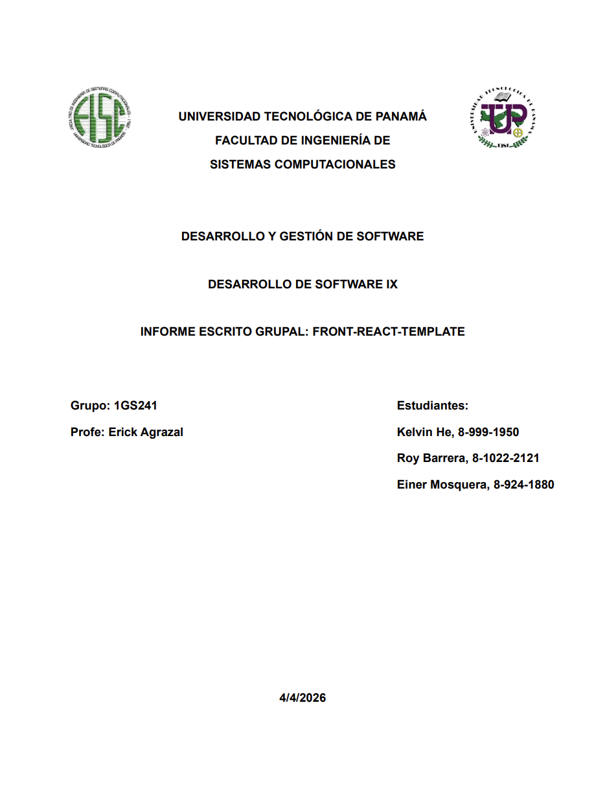
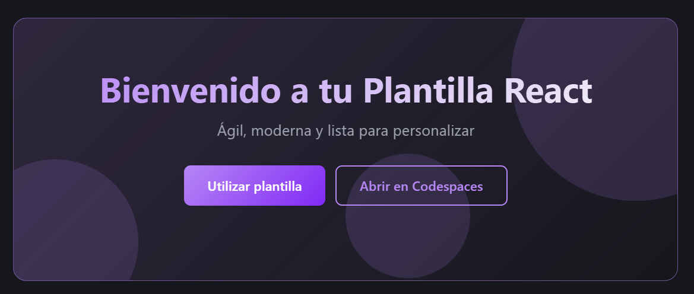
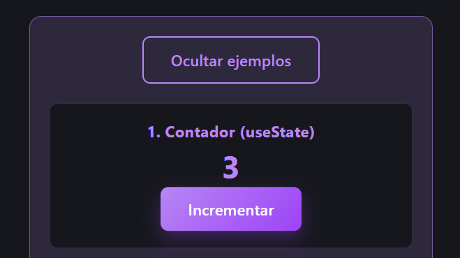
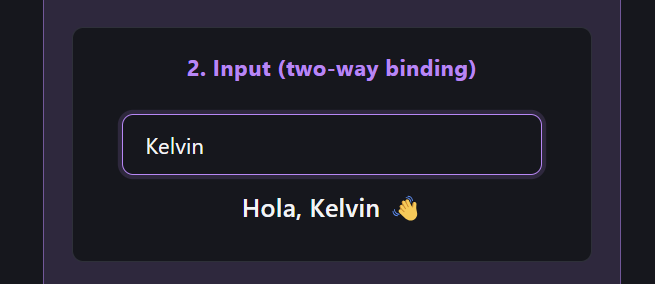
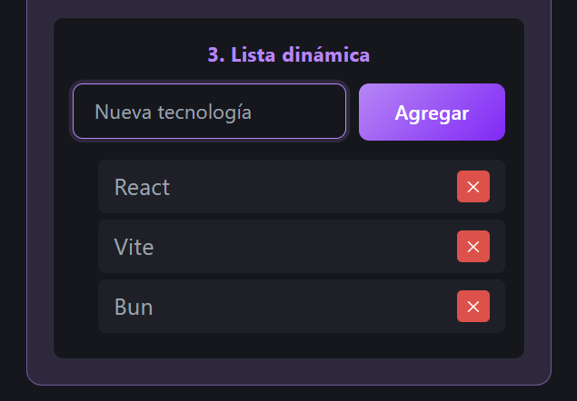

# INFORME ACADÉMICO COMPLETO - FRONT REACT TEMPLATE
## PORTADA

---

## RESUMEN EJECUTIVO

El presente informe académico documenta el proceso de desarrollo, implementación y descripción de una plantilla frontend reutilizable denominada "Front React Template", construida utilizando tecnologías modernas como React 19, Vite 8 y Bun. Esta plantilla fue desarrollada como proyecto académico para la Universidad Tecnológica de Panamá, específicamente para la materia de Desarrollo de Software IX bajo la supervisión del profesor Erick Agrazal.

El objetivo principal de este proyecto es proporcionar una base sólida y profesional para desarrolladores que inician nuevos proyectos de aplicaciones web frontend, eliminando la necesidad de realizar configuraciones iniciales repetitivas que consumen tiempo valioso. La plantilla desarrollada incluye una estructura de carpetas organizada y escalable, ejemplos prácticos interactivos que demuestran conceptos fundamentales de React, configuración completa de variables de entorno, documentación detallada en español y preparación lista para publicación como repositorio template en GitHub.

Este documento presenta de manera exhaustiva todos los componentes, características, tecnologías utilizadas y el proceso de desarrollo del proyecto, cumpliendo con los requisitos establecidos en la rúbrica de evaluación académica. La metodología empleada se basó en principios de desarrollo ágil, iterando sobre la estructura del proyecto hasta lograr un producto funcional que cumpliera con todos los objetivos planteados inicialmente.

---

## 1. INTRODUCCIÓN

### 1.1 Contextualización del Tema

En el contexto actual del desarrollo web moderno, la creación de aplicaciones frontend representa uno de los pilares fundamentales de la ingeniería de software. La creciente demanda de interfaces de usuario dinámicas, responsivas y de alto rendimiento ha impulsado la evolución constante de las herramientas y frameworks disponibles para los desarrolladores. Entre estas herramientas, React se ha consolidado como una de las bibliotecas más utilizadas a nivel mundial para la construcción de interfaces de usuario basadas en componentes, siendo desarrollada y mantenida por Meta (anteriormente Facebook) desde 2013.

Sin embargo, iniciar un nuevo proyecto desde cero implica una serie de configuraciones iniciales que pueden resultar repetitivas y consumir tiempo valioso que podría dedicarse al desarrollo de funcionalidades específicas de la aplicación. Configurar el entorno de build, establecer la estructura de carpetas, configurar linters, definir variables de entorno y preparar la documentación son tareas que se realizan de manera prácticamente idéntica en cada nuevo proyecto, representando una inversión de tiempo significativa que no aporta valor diferencial al desarrollo. Esta problemática ha llevado a la comunidad de desarrolladores a crear plantillas y generadores que automatizan estas tareas repetitivas, permitiendo enfocarse en la lógica de negocio de cada aplicación.

### 1.2 Planteamiento del Problema

El problema identificado en el desarrollo de proyectos frontend es la repetición constante de configuraciones iniciales en cada nuevo proyecto. Cuando un desarrollador necesita iniciar una nueva aplicación con React, debe realizar manualmente las siguientes tareas:

1. Crear la estructura de carpetas organizadas por responsabilidad
2.	Configurar el bundler y herramientas de build
3.	Instalar dependencias base del proyecto
4.	Configurar el linter y formateador de código
5.	Establecer variables de entorno
6.	Crear archivos de configuración básicos
7.	Preparar documentación inicial
8.	Configurar el entorno de desarrollo

Este proceso, aunque necesario, no aporta valor diferencial al proyecto y consume tiempo considerable que podría utilizarse en funcionalidades específicas del negocio o aplicación. La solución a este problema consiste en crear una plantilla reutilizable que incluya todas estas configuraciones por defecto, permitiendo a los desarrolladores comenzar a trabajar inmediatamente en aspectos más importantes del proyecto.

### 1.3 Justificación del Proyecto

El presente informe documenta el desarrollo de una plantilla frontend reutilizable desarrollada con React, Vite y Bun, diseñada específicamente para servir como punto de partida en proyectos futuros. Esta plantilla, denominada "Front React Template", busca proporcionar una base sólida y profesional que permita a los desarrolladores iniciar nuevos proyectos de manera inmediata, manteniendo estándares de calidad y buenas prácticas de desarrollo desde el primer momento.

La elección de las tecnologías utilizadas (React 19, Vite 8, Bun) responde a la necesidad de utilizar herramientas modernas, de alto rendimiento y con gran comunidad de soporte. React ofrece un modelo de programación basado en componentes que facilita la reutilización de código y el mantenimiento de aplicaciones. Vite proporciona tiempos de compilación extremadamente rápidos gracias a su arquitectura basada en ES modules. Bun, por su parte, ofrece velocidades de instalación de dependencias significativamente superiores comparadas con npm tradicional. La combinación de estas tres tecnologías crea un entorno de desarrollo óptimo que maximiza la productividad del equipo.

### 1.4 Objetivos del Proyecto

**Objetivo General**

Desarrollar una plantilla frontend reutilizable basada en React, Vite y Bun que funcione como repositorio tipo template en GitHub, proporcionando una estructura de proyecto profesional, funcional y lista para usar en nuevos desarrollos, eliminando la necesidad de configuraciones iniciales repetitivas.

**Objetivos Específicos**

1. Implementar una estructura de carpetas organizada y escalable que separe claramente las responsabilidades del código.
2.	Configurar el entorno de desarrollo con Vite para garantizar tiempos de compilación rápidos y una experiencia de desarrollo óptima.
3.	Establecer una configuración base de variables de entorno que permita la personalización de la aplicación sin modificar el código fuente.
4.	Incluir documentación clara y completa en formato README que explique cómo utilizar, personalizar y publicar la plantilla.
5.	Preparar la plantilla para su publicación como template repository en GitHub, eliminando cualquier branding específico y utilizando idioma español.
6.	Implementar ejemplos funcionales demostrativos que demuestren las capacidades de la plantilla sin requerir configuración adicional.
7.	Configurar herramientas de linting (ESLint) para mantener la calidad del código y verificar la integridad del proyecto antes de su publicación.

---

## 2. MARCO TEÓRICO

### 2.1 React 19

React es una biblioteca de JavaScript de código abierto desarrollada por Meta (anteriormente Facebook) que permite construir interfaces de usuario interactivas y reactivas. Su modelo de programación basado en componentes permite crear piezas de código reutilizables que encapsulan su propia lógica, estado y presentación. La filosofía de React se centra en crear componentes independientes y reutilizables que manejan su propio estado y renderizado, facilitando la construcción de interfaces complejas a partir de piezas más pequeñas y manejables.

La versión 19, utilizada en este proyecto, representa la última versión estable de la biblioteca, ofreciendo mejoras en rendimiento y nuevas funcionalidades para el desarrollo moderno de aplicaciones web. React utiliza un Virtual DOM que permite actualizaciones eficientes de la interfaz de usuario, comparando automáticamente los cambios y aplicando únicamente las modificaciones necesarias. Este mecanismo de renderizado es significativamente más eficiente que la manipulación directa del DOM real, ya que minimiza las operaciones costosas del navegador.

Entre las características principales de React se encuentran:

- Componentes reutilizables con estado propio
- Virtual DOM para rendimiento óptimo
- One-way data flow para predictable state management
- Gran ecosistema de librerías y herramientas
- Comunidad masiva y bien establecida

### 2.2 Vite 8

Vite es una herramienta de build y servidor de desarrollo que proporciona una experiencia de desarrollo significativamente más rápida comparada con herramientas tradicionales como Webpack. Funciona utilizando ES modules nativamente en el navegador, eliminando la necesidad de bundling durante el desarrollo. Esta aproximación revolutionary permite que el navegador cargue los módulos directamente, aprovechando la compatibilidad nativa de los navegadores modernos con ES modules, lo que resulta en tiempos de inicio instantáneos independientemente del tamaño del proyecto.

La versión 8 ofrece soporte mejorado para React y optimizaciones adicionales en el proceso de build para producción. Vite permite características como Hot Module Replacement (HMR) casi instantáneo, configuración mínima y una experiencia de desarrollo fluida. El sistema HMR de Vite es capaz de mantener el estado de la aplicación mientras actualiza solo los módulos modificados, lo que significa que los desarrolladores pueden ver sus cambios reflejados inmediatamente sin perder el estado actual de la aplicación.

Las características principales de Vite incluyen:

- Servidor de desarrollo ultra-rápido con HMR instantáneo
- Build optimizado para producción
-	Configuración mínima y configuración cero
-	Soporte nativo para TypeScript, JSX y CSS
-	Plugins extensibles para integración con frameworks

### 2.3 Bun

Bun es un runtime de JavaScript moderno diseñado para ser ultrarrápido y todo-en-uno. Incluye un gestor de paquetes integrado, un runtime de JavaScript y una herramienta de bundling. En este proyecto, Bun se utiliza principalmente como gestor de paquetes, ofreciendo velocidades de instalación significativamente superiores comparadas con npm tradicional. La arquitectura de Bun está optimizada para rendimiento, utilizando el motor JavaScriptCore de WebKit en lugar del motor V8 de Chrome, lo que proporciona tiempos de ejecución más rápidos en ciertos escenarios.

Las características principales de Bun incluyen:

- Instalación de dependencias hasta 10x más rápida que npm
- Runtime de JavaScript nativo de alto rendimiento
- Gestor de paquetes integrado
-	Compatibilidad con npm/yarn
-	API similar a Node.js

### 2.4 JavaScript con JSX

La plantilla utiliza JavaScript puro con sintaxis JSX en lugar de TypeScript. Esta decisión se tomó para mantener la simplicidad y reducir la curva de aprendizaje para desarrolladores que no están familiarizados con TypeScript. JSX permite escribir código que parece HTML dentro de JavaScript, facilitando la creación de componentes React de manera declarativa y legible. La sintaxis JSX se transforma en llamadas a la función `React.createElement()` durante el proceso de build, permitiendo que los desarrolladores escriban interfaz de usuario de manera intuitiva mientras mantienen toda la potencia de JavaScript.

### 2.5 ESLint

ESLint es una herramienta de análisis de código estático ampliamente utilizada para identificar patrones problemáticos en el código JavaScript. La configuración incluida en la plantilla utiliza plugins específicos para React y React Hooks, garantizando que el código siga las mejores prácticas y mantenga consistencia estilística a través del proyecto. Las reglas configuradas incluyen verificaciones para common errors, mejores prácticas de código, y consistencia estilística, permitiendo detectar problemas potenciales antes de que se conviertan en bugs en producción.

---

## 3. DESARROLLO DEL PROYECTO

### 3.1 Proceso de Creación

El proceso de creación comenzó utilizando Bun junto con Vite como herramienta de scaffolding. El comando utilizado fue:

```
bun create vite front-react-template --template react
```

Este comando genera la estructura base del proyecto con React y JSX configurados. Posteriormente se instalaron las dependencias utilizando Bun y se configuró ESLint para garantizar la calidad del código. El flujo de trabajo consistió en crear la estructura inicial, instalar las dependencias necesarias, configurar las herramientas de linting, y posteriormente desarrollar los componentes y funcionalidades específicas de la plantilla.

### 3.2 Estructura de Carpetas

Se diseñó una estructura de carpetas que sigue las mejores prácticas para proyectos React de escala media:

```
front-react-template/
├── public/
│   └── favicon.svg
├── src/
│   ├── components/
│   │   ├── MainSection.jsx
│   │   └── DemoEjemplos.jsx
│   ├── config/
│   │   └── env.js
│   ├── layouts/
│   │   └── AppLayout.jsx
│   ├── pages/
│   │   └── HomePage.jsx
│   ├── styles/
│   │   ├── global.css
│   │   └── home.css
│   ├── App.jsx
│   ├── main.jsx
│   └── index.css
├── .env.example
├── eslint.config.js
├── index.html
├── package.json
├── vite.config.js
├── bun.lock
└── README.md
```

Esta estructura sigue el principio de separación de responsabilidades, organizando el código en carpetas según su función dentro de la aplicación. La carpeta `components` contiene los componentes reutilizables, `config` maneja la configuración centralizada, `layouts` define las estructuras de página comunes, `pages` contiene las vistas principales, y `styles` maneja los archivos CSS específicos de cada sección.

### 3.3 Componentes Desarrollados

#### 3.3.1 MainSection.jsx

El componente MainSection representa la sección principal del hero de la página de inicio. Incluye un título principal con gradiente, un subtítulo, dos botones de acción que dirigen a la plantilla y a Codespaces, y elementos decorativos animados que mejoran la experiencia visual.

Características principales:

- Diseño moderno con gradientes
- Botones de navegación funcional
- Animaciones decorativas
- Responsive design

<p align="center">
  
</p>


#### 3.3.2 DemoEjemplos.jsx

El componente DemoEjemplos es una adición importante que demuestra tres conceptos fundamentales de React de manera interactiva:

**Ejemplo 1: Contador**

Demuestra el uso de useState para gestionar estado en un componente funcional. El usuario puede incrementar un contador haciendo click en el botón, viendo cómo React actualiza automáticamente la interfaz.

<p align="center">
  
</p>


**Ejemplo 2: Input**

Demuestra el binding bidireccional en React. El usuario escribe en un campo de texto y el valor se muestra en tiempo real, demostrando cómo el estado de React se sincroniza con la interfaz de usuario.

<p align="center">
  
</p>

**Ejemplo 3: Lista Dinámica**

Demuestra el renderizado de listas usando el método map(). El usuario puede agregar nuevos elementos a una lista y eliminar elementos existentes, demostrando manipulación dinámica del estado.

<p align="center">
  
</p>

### 3.4 Variables de Entorno

El proyecto utiliza un sistema de variables de entorno configurable a través del archivo .env.example, que incluye las siguientes variables:

- VITE_APP_NAME
- VITE_APP_DESCRIPTION
- VITE_DOCS_URL
- VITE_USE_TEMPLATE_URL
- VITE_CODESPACE_URL

---

## 4. DESCRIPCIÓN DE LA ESTRUCTURA DEL PROYECTO

**Directorio raíz:**

| Archivo/Carpeta | Descripción |
|--------------|------------|
| public/ | Directorio que contiene recursos estáticos públicos |
| src/ | Directorio principal que contiene el código fuente |
| .env.example | Archivo de referencia para variables de entorno |
| eslint.config.js | Archivo de configuración de ESLint |
| index.html | Archivo HTML principal |
| package.json | Archivo de configuración de dependencias |
| vite.config.js | Archivo de configuración de Vite |
| bun.lock | Archivo de bloqueo de dependencias |
| README.md | Archivo de documentación principal |

**Directorio public/:**

| Archivo | Descripción |
|---------|------------|
| favicon.svg | Icono de la aplicación |

**Directorio src/:**

| Archivo/Carpeta | Descripción |
|--------------|------------|
| components/ | Directorio de componentes reutilizables |
| config/ | Directorio de configuración |
| layouts/ | Directorio de layouts |
| pages/ | Directorio de páginas |
| styles/ | Directorio de estilos |
| App.jsx | Componente raíz |
| main.jsx | Punto de entrada |
| index.css | Estilos base |

**Directorio src/components/:**

| Archivo | Descripción |
|---------|------------|
| MainSection.jsx | Componente de sección principal |
| DemoEjemplos.jsx | Componente de ejemplos interactivos |

**Directorio src/config/:**

| Archivo | Descripción |
|---------|------------|
| env.js | Archivo de variables de entorno |

**Directorio src/layouts/:**

| Archivo | Descripción |
|---------|------------|
| AppLayout.jsx | Layout base de la aplicación |

**Directorio src/pages/:**

| Archivo | Descripción |
|---------|------------|
| HomePage.jsx | Página principal |

**Directorio src/styles/:**

| Archivo | Descripción |
|---------|------------|
| global.css | Estilos globales |
| home.css | Estilos de la página de inicio |

---

## 5. RESULTADOS

Se ha logrado desarrollar una plantilla frontend completa y funcional que cumple con todos los objetivos establecidos:

- **Estructura profesional**: La plantilla cuenta con una estructura de carpetas clara y escalable
- **Documentación completa**: El README.md incluye instrucciones detalladas en español
- **Ejemplos funcionales**: Página de inicio con ejemplos interactivos que demuestran conceptos básicos de React
- **Configuración de calidad**: La plantilla incluye configuración de ESLint
- **Variables de entorno**: Sistema de configuración implementado con archivo de referencia
- **Preparación para GitHub**: Lista para ser publicada como template repository
- **Rendimiento optimizado**: El uso de Vite garantiza tiempos de desarrollo rápidos
- **Adaptabilidad automática**: La plantilla respeta la preferencia de color del sistema operativo

---

## 6. CONCLUSIONES INDIVIDUALES

### 6.1 Conclusión de Kelvin He (8-999-1950)

A través del desarrollo de este proyecto de Front React Template, he logrado comprender de manera profunda la importancia de establecer patrones y estructuras reusable en el desarrollo de software. La experiencia de crear una plantilla que pueda ser utilizada por otros desarrolladores me ha enseñado que la documentación clara y la organización del código son tan importantes como la funcionalidad misma.

Uno de los aprendizajes más significativos fue entender cómo funciona el sistema de variables de entorno en Vite y cómo implementarlo de manera que los usuarios puedan personalizar la aplicación sin modificar el código fuente. Esto es algo que aplicaré en futuros proyectos para hacer mis aplicaciones más configurables y mantenibles.

También pude profundizar en mis habilidades con React, específicamente en el uso de useState para gestionar estado y cómo renderizar listas dinámicamente con map(). Estos conceptos fundamentales son la base para aplicaciones React más complejas.

### 6.2 Conclusión de Roy Barrera (8-1022-2121)

Desarrollar el componente DemoEjemplos fue una experiencia muy enriquecedora para mí. Tuve la oportunidad de aplicar los conceptos teóricos de React en un ejemplo práctico y funcional. Explicar el uso de useState, el binding bidireccional y el renderizado de listas de una manera que fuera fácil de entender para otros fue un desafío que me ayudó a solidify mi comprensión.

También aprendí la importancia de usar herramientas como ESLint para mantener un código limpio y consistente, especialmente cuando se trabaja en equipo. El poder detectar errores de manera automática antes de que se conviertan en problemas es algo muy valioso.

Este proyecto me ha convencido de la importancia de utilizar herramientas modernas como Bun para el desarrollo, ya que la velocidad de instalación de dependencias hace una gran diferencia en el flujo de trabajo.

### 6.3 Conclusión de Einer Mosquera (8-924-1880)

Mi participación en este proyecto me permitió aplicar los conocimientos adquiridos durante el curso en un proyecto real y funcional. Ver cómo una plantilla funciona cuando otros desarrolladores la utilizan es una experiencia muy satisfactoria.

Lo que más me interesó fue trabajar con Vite y experimentar su sistema de Hot Module Replacement, que hace el desarrollo mucho más rápido y eficiente. Poder ver los cambios en tiempo real sin necesidad de recargar la página es algo que mejora significativamente la experiencia de desarrollo.

También aprendí la importancia de escribir una buena documentación. Un proyecto bien documentado puede ser utilizado por muchas más personas y tiene mayor impacto en la comunidad.

---

## 7. BIBLIOGRAFÍA

- Bun. (s. f.). Bun documentation. Recuperado el 4 de abril de 2026, de https://bun.sh/
- ESLint. (s. f.). ESLint: Pluggable JavaScript linter. Recuperado el 4 de abril de 2026, de https://eslint.org/
- Meta Platforms, Inc. (s. f.). React documentation. Recuperado el 4 de abril de 2026, de https://react.dev/
- Vite Team. (s. f.). Vite: Next generation frontend tooling. Recuperado el 4 de abril de 2026, de https://vitejs.dev/
- Orli Dun. (2024, mayo 31). Estructuras de carpetas en proyectos web: Una guía al estilo de los Sims. DEV Community. https://dev.to/orli/-estructuras-de-carpetas-en-proyectos-web-una-guia-al-estilo-de-los-sims-34jm